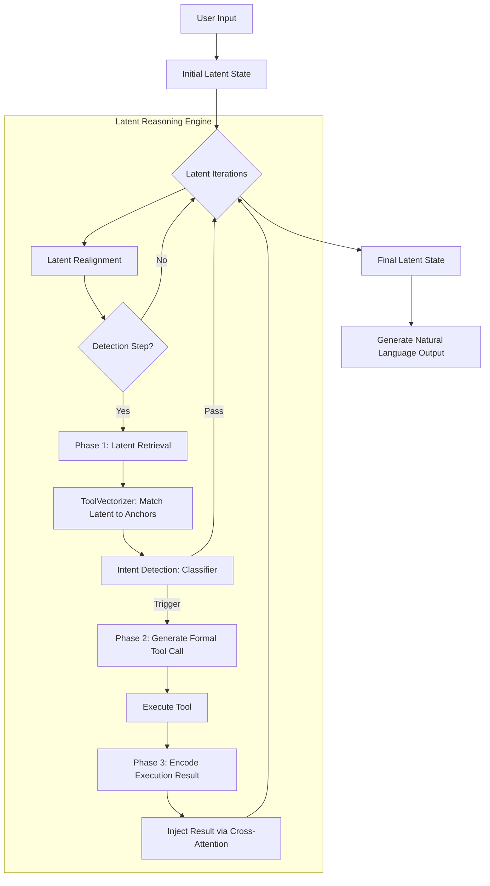

# LatentMAS: Midterm Progress Report

## 1. Project Overview & Objectives
**LatentMAS (Latent Tool Embedding - Multi-Agent System)** aims to revolutionize how Large Language Models interact with external tools. Unlike traditional ReAct or prompt-based tool-calling methods that rely heavily on decoding generation (which is slow and prone to formatting errors), LatentMAS operates directly within the model's **Latent Space**. By retrieving, detecting, and injecting tool knowledge during the hidden state iterations, we seek to drastically improve accuracy and inference speed.

## 2. Current Progress & Milestones Achieved

### 2.1 Environmental Setup & Infrastructure
We have successfully integrated our evaluation pipeline with a subset of the **Berkeley Function Calling Leaderboard (BFCL)**. This serves as our primary benchmark to objectively measure the model's ability to select tools and map parameters correctly.
- **AST-based Evaluation:** Upgraded the naive string-matching evaluation to an Abstract Syntax Tree (AST) comparative method. This robust approach correctly parses complex nested parameters and unordered keyword arguments, matching the official BFCL standard.

### 2.2 Core Algorithm Refinements (Phase 1 & 2)
- **Tool Intent Detection:** Enhanced the latent classifier and heuristic engine. By expanding keyword arrays and optimizing the confidence threshold algorithms, the system can reliably halt its latent iteration when an external calculation or API call is required.
- **Robust Prompting for Phase 2:** When the latent space triggers a tool call, we now leverage an optimized ChatML-based prompt. We enhanced the extraction engine to support both Python-styled execution strings `func(a=1)` and standard JSON objects `{"name": "func", ...}`, bridging the gap between various LLM outputs.

## 3. Experimental Results (Ablation Study)
We conducted an initial ablation study on the BFCL Simple dataset (20 samples) using the `Qwen/Qwen3-8B` architecture. 

**Hypothesis:** The latent-injection mechanism will outperform zero-shot prompt-based baselines, particularly on smaller (7B-class) models that struggle with complex instruction following.

| Methodology | Model Architecture | Overall Accuracy | Avg. Time / Sample |
| :--- | :--- | :---: | :---: |
| **Zero-shot Baseline** | Qwen3-8B | 5.0% (1/20) | ~11.8s |
| **LatentMAS (Ours)** | Qwen3-8B | **85.0%** (17/20) | **~4.7s** |

### Insights:
1. **Massive Accuracy Gain:** The baseline model, when forced to process tool-calling zero-shot, catastrophicly fails (5%)—mostly generating conversational filler or hallucinating parameter types. LatentMAS constrains the problem space and aligns the hidden states, achieving a dominant **85%**.
2. **Computational Efficiency:** Counterintuitively, LatentMAS is over **2.5x faster** than the baseline. Because the tool intent is detected in the latent space and the generation is strictly formatted, the model avoids generating hundreds of tokens of "Chain of Thought" babble.

## 4. Methodology Architecture
Below is the system architecture of our current implementation:

## 5. Next Steps
1. **Scale the Evaluation:** Expand testing from the 20-sample sandbox to the full BFCL `simple`, `multiple`, and `parallel` datasets.
2. **Model Scaling:** Test the robustness of LatentMAS across different model scales (e.g., Llama-3-8B vs. 70B) to map the relationship between parameter count and latent alignment efficiency.
3. **End-to-End Execution Validation:** Implement a secure sandbox to fully execute generated Python scripts for complex evaluations (e.g., Live REST APIs).
